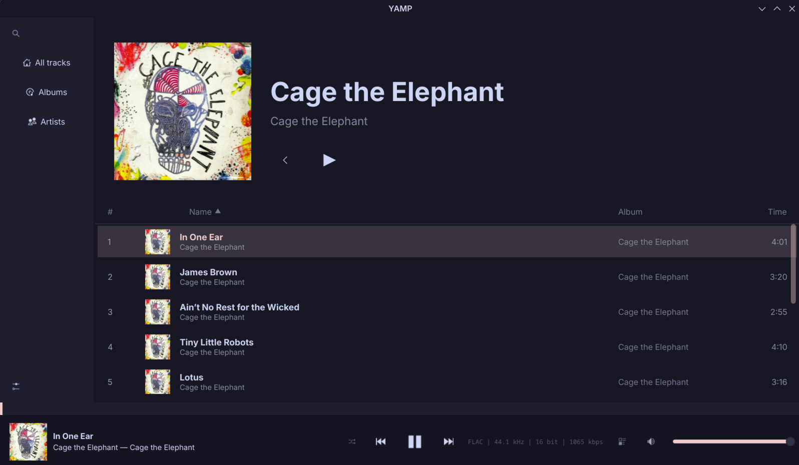

<div align="center">


# YAMP

**Yet Another Music Player**

A performance-oriented, ultra-lightweight music player built with C++, Qt 6 and QML.

[](LICENSE)
[](https://aur.archlinux.org/packages/yamp-git)
[](https://www.qt.io/)

</div>

---

> **⚠️ Project status — experimental early access**
>
> Functional for daily use, but may contain bugs. Active development is ongoing and features are subject to change.

## Screenshots

<p align="center">
  
  
</p>
<p align="center">
  
  
</p>
<p align="center">
  
</p>

## Features

- **Fast media scanning** — SQLite-backed library handles thousands of tracks instantly.
- **MPRIS support** — full integration with system media controllers and lock screens.
- **Modern stack** — built on Qt 6.8+, QtMultimedia and TagLib.

## Installation

### Arch Linux — AUR

YAMP is in the AUR. Install via any helper:

```bash
yay -S yamp-git
```

### From source — `makepkg`

```bash
sudo pacman -S --needed base-devel cmake git ninja qt6-base qt6-declarative qt6-multimedia taglib
git clone https://github.com/Wu28ri/yamp.git
cd yamp
makepkg -si
```

### Manual build — CMake

```bash
git clone https://github.com/Wu28ri/yamp.git
cd yamp
cmake -B build -G Ninja -DCMAKE_BUILD_TYPE=Release
cmake --build build
./build/appyamp
```

## License

YAMP is released under the GPLv3 license. See [LICENSE](LICENSE) for details.
