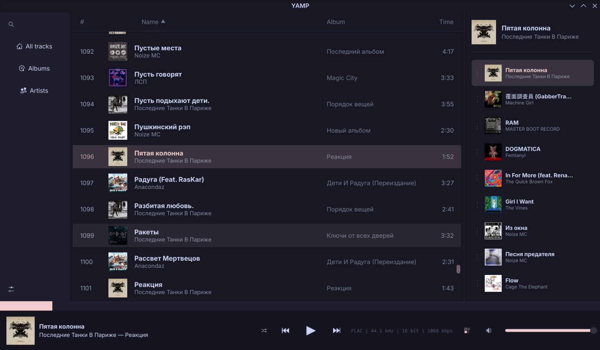
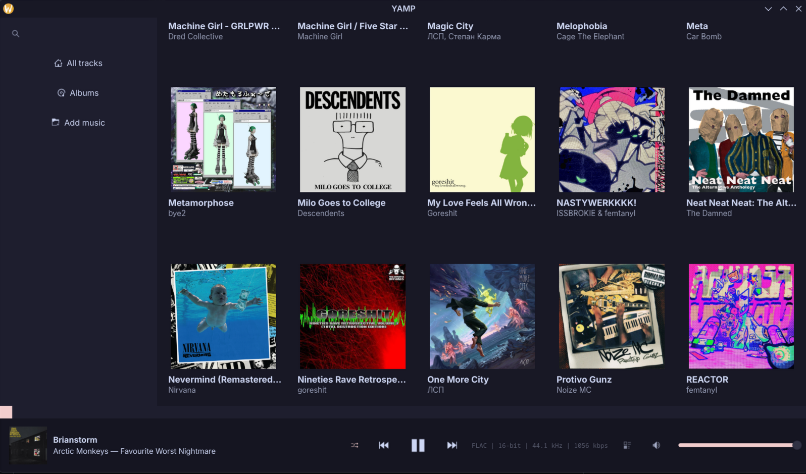
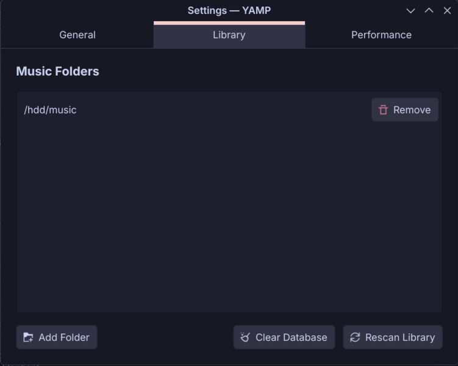
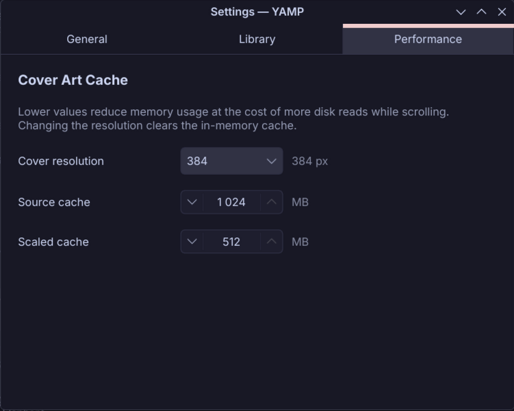

# YAMP — Yet Another Music Player

A performance-oriented, ultra-lightweight music player built with C++, Qt 6, and QML.








## ⚠️ Project Status: Experimental Early Access
This project is currently in a **very early stage of development**. 
- It is functional for daily use but may contain bugs.
- Active development is ongoing.
- Features are subject to change.

## Key Features
- **Fast Media Scanning:** SQLite-backed library management for handling thousands of tracks instantly.
- **MPRIS Support:** Full integration with system media controllers and lock screens.
- **Modern Stack:** Built using Qt 6.8+, QtMultimedia, and TagLib.

## Prerequisites
To build YAMP, you need the following packages installed:

```bash for arch based
sudo pacman -S --needed base-devel cmake git ninja qt6-base qt6-declarative qt6-multimedia taglib
```
Installation

YAMP is now in the AUR. Install via any AUR helper.

```Bash
yay -S yamp-git
```
without helpers

Clone the repository:
```Bash
    git clone https://github.com/Wu28ri/yamp.git
    cd yamp
```
  Build and install using makepkg:
```Bash
makepkg -si
```
Manual Build (CMake)
```Bash

git clone https://github.com/Wu28ri/yamp.git
cd yamp
cmake -B build -G Ninja -DCMAKE_BUILD_TYPE=Release
cmake --build build
# To run without installing:
./build/appyamp
```
License

This project is licensed under the GPLv3 License. See the LICENSE file for details.
